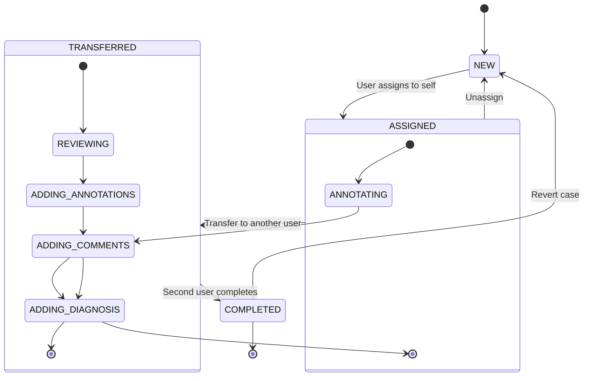
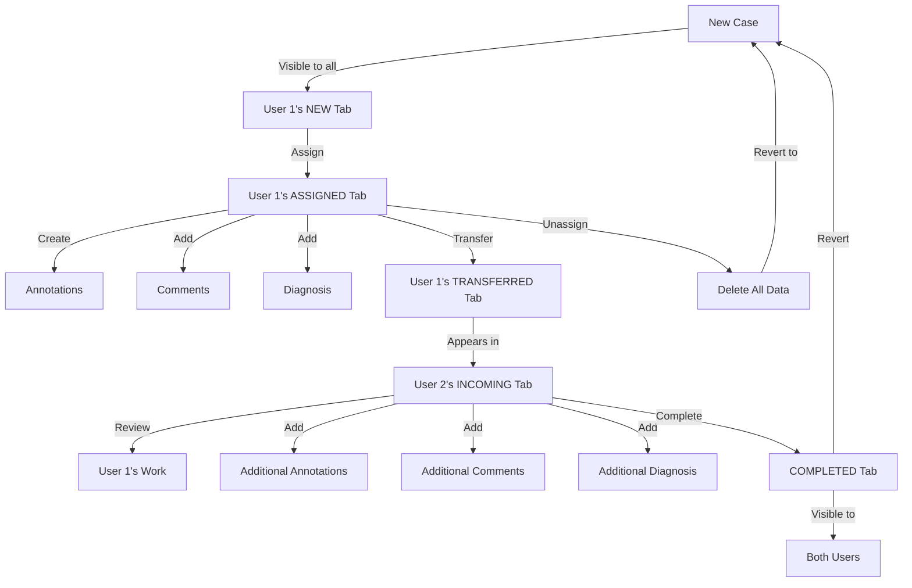

# Architecture Overview

## System Architecture

The Diagnostic Runtime Application follows a layered architecture pattern with the following components:

### 1. Presentation Layer
- REST Controllers
- API Documentation (Swagger/OpenAPI)
- Authentication and Authorization (Currently simple JWT)

### 2. Service Layer
- Business Logic Implementation
- Transaction Management
- Integration with External Services

### 3. Data Access Layer
- MongoDB Repositories
- Data Models
- Database Migrations

### 4. Infrastructure Layer
- AWS Integration
- Docker Containerization
- Configuration Management

## Data Model Architecture

### Core Entities and Relationships

```
Patient
  └── Case (1:N)
       ├── RADIOLOGY
       │    └── Slide (1:N)
       │         ├── DICOM
       │         ├── SVS
       │         └── TIFF
       │              └── Annotation (1:N)
       │                   ├── Manual
       │                   └── AI (from AI microservice)
       └── PATHOLOGY
            └── Slide (1:N)
                 ├── SVS
                 └── TIFF
                      └── Annotation (1:N)
                           ├── Manual
                           └── AI (from AI microservice)
```

### Entity Details

1. **Patient**
    - Basic patient information `age` `mrn`
    - Can have multiple cases
    - Unique patient identifier `praidId` `UUID`

2. **Case**
    - Belongs to a Patient
    - Two types:
        - **RADIOLOGY**: For X-rays and similar imaging
        - **PATHOLOGY**: For whole slide images
    - Contains case-specific metadata

3. **Slide**
    - Belongs to a Case
    - Format varies by CaseType:
        - **RADIOLOGY**: `DICOM, SVS, or TIFF`
        - **PATHOLOGY**: `SVS or TIFF`
    - Contains slide metadata and image data
    - Slides themselves are saved on `s3` their identifiers are saved in database i.e  `names along with file extenstion `
      ```
      private String slideImagePath -> Name along with extension
 
      private String showImagePath  -> Can be used for thumbnail
 
      private String microMeterPerPixel -> Describes resolution of the whole slide image
      ```

4. **Annotation**
    - Belongs to a Slide
    - Two creation types:
        - **Manual**: Created by users through the UI
        - **AI**: Generated by the AI microservice
    - Contains annotation data and metadata

## Data Flow

1. **Case Creation**
   ```
   Patient -> Create Case -> Specify Type (RADIOLOGY/PATHOLOGY) -> Upload Slides
   ```

2. **Slide Processing**
   ```
   Upload Slide -> Validate Format -> Store -> Process (if AI enabled)
   ```

3. **Annotation Workflow**
   ```
   Manual: User -> Select Slide -> Create Annotation -> Save
   AI: Slide -> AI Microservice -> Process -> Create Annotation -> Save
   ```


## Two-Eye Principle Workflow

### State Diagram


### User Flow Diagram


### Case States
```
NEW -> ASSIGNED -> TRANSFERRED -> COMPLETED
   \-> UNASSIGNED (reverts to NEW)
```

### State Transitions and User Actions

1. **Initial State (NEW)**
   - Case is visible to all PATHOLOGIST/RADIOLOGIST users in their "NEW" tab
   - No annotations or comments exist
   - First user can assign the case to themselves

2. **Assigned State (ASSIGNED)**
   - Case appears only in the assigned user's "ASSIGNED" tab
   - Assigned user can:
     - Create annotations
     - Add comments
     - Add diagnosis
     - Transfer case to another user
     - Unassign the case

3. **Transferred State (TRANSFERRED)**
   - Case appears in:
     - First user's "TRANSFERRED" tab
     - Second user's "INCOMING" tab
   - First user's annotations and comments are preserved
   - Second user can:
     - Create additional annotations
     - Add their own comments
     - Add their diagnosis
     - Complete the case

4. **Completed State (COMPLETED)**
   - Case appears in "COMPLETED" tab for both users
   - All annotations and comments are preserved
   - Case can be reverted to NEW state to restart the process

### State Transition Rules

1. **Assignment**
   ```
   NEW -> ASSIGNED
   - User assigns case to themselves
   - Case moves to their ASSIGNED tab
   ```

2. **Transfer**
   ```
   ASSIGNED -> TRANSFERRED
   - First user transfers to second user
   - Case appears in TRANSFERRED and INCOMING tabs
   ```

3. **Unassignment**
   ```
   ASSIGNED -> NEW
   - User unassigns the case
   - All annotations and comments are deleted
   - Case returns to NEW state
   ```

4. **Completion**
   ```
   TRANSFERRED -> COMPLETED
   - Second user completes the case
   - Case appears in COMPLETED tab for both users
   ```

5. **Revert**
   ```
   COMPLETED -> NEW
   - Case is reverted to NEW state
   - Process can restart with different users
   ```

### Data Persistence Rules

1. **During Assignment**
   - No data is created yet
   - Only state change occurs

2. **During Transfer**
   - First user's annotations and comments are preserved
   - Case history is maintained

3. **During Unassignment**
   - All annotations and comments are deleted
   - Case returns to initial state

4. **During Completion**
   - All annotations and comments from both users are preserved
   - Final diagnosis is recorded


## Key Components

### Annotation System
- Handles medical image annotations
- Supports multiple annotation types
- Integrates with AI processing
- Manages annotation states and workflows

### Disease Classification
- Organ-specific disease classification
- Grading system
- Subtype management
- Disease spectrum

### Patient Management
- Case management
- Slide organization
- Report generation
- Data anonymization

### AI Processing
- EC2-based processing
- Task queue management
- Result processing
- Error handling and retry mechanisms

## Data Flow

1. **Image Upload and Processing**
   ```
   User[PATHOLOGY/RADIOLOGY TECHNICIAN] -> Upload Image -> Slide Management -> AI Processing -> Annotation
   ```

2. **Annotation Workflow**
   ```
   User[PATHOLOGIST/RADIOLOGIST] -> Create Annotation -> Disease Classification -> Grading -> Report Generation
   ```

3. **AI Task Processing**
   ```
   Slide Upload -> Task Creation[CRON JOB] -> AI Microservice Processing -> AI Annotation saved for Slide
   ```

## Security Architecture

- JWT-based authentication
- Role-based access control
- Data encryption
- Secure API endpoints

## Scalability Considerations

- Horizontal scaling with Docker
- MongoDB sharding
- EC2 auto-scaling for AI processing
- Caching strategies

## Monitoring and Logging

- Application metrics
- Performance monitoring
- Error tracking
- Audit logging

## Integration Points

- AWS Services (EC2, S3)
- External AI Models
- Medical Imaging Systems
- Reporting Systems 